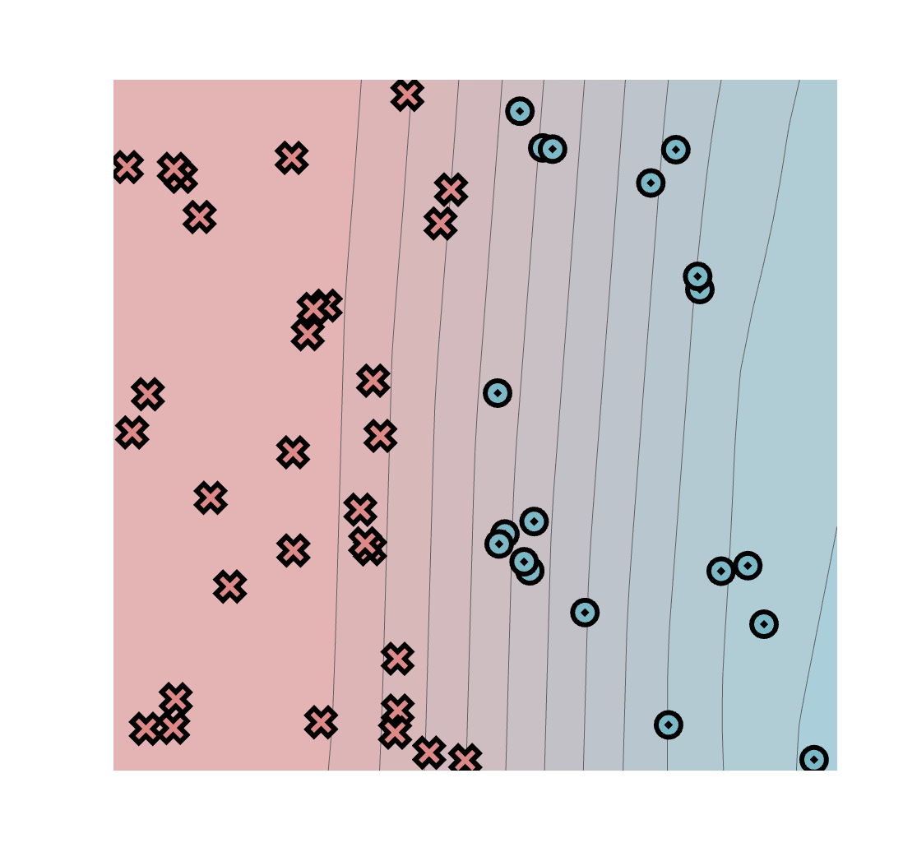
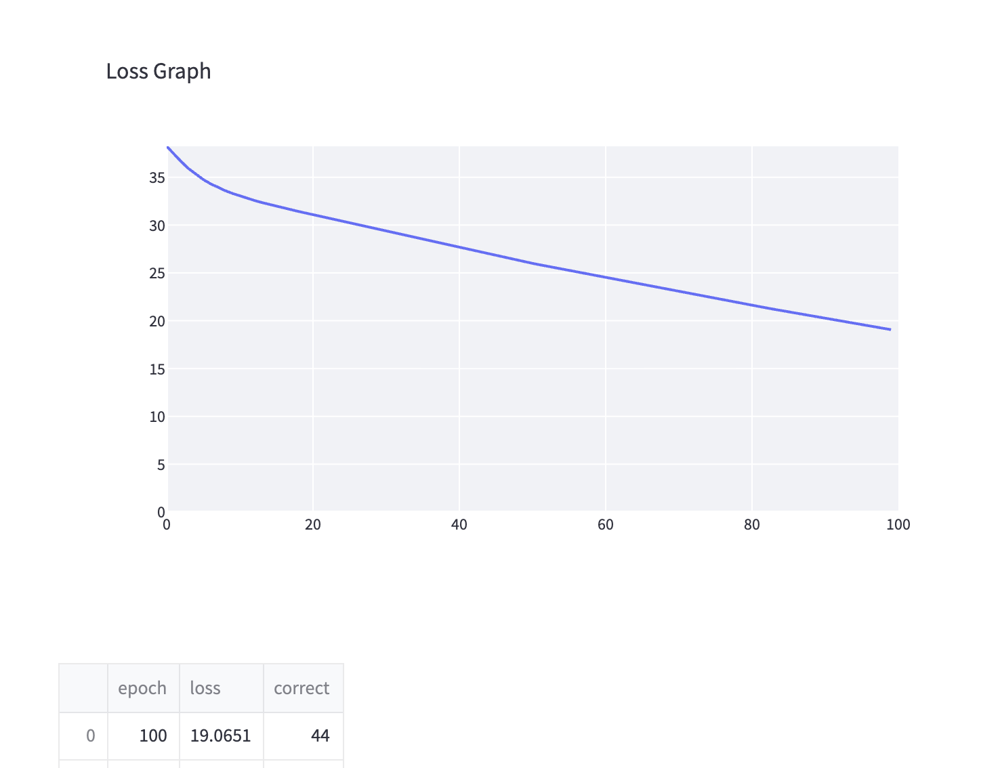
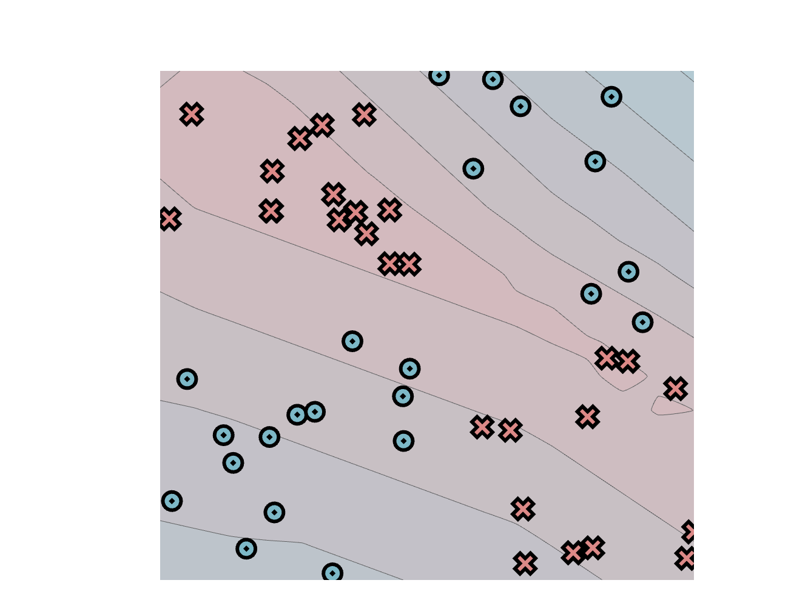
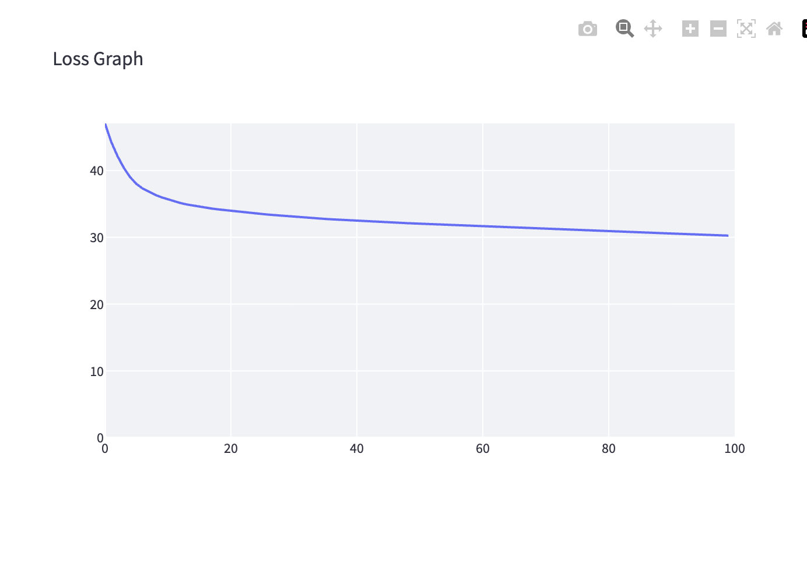
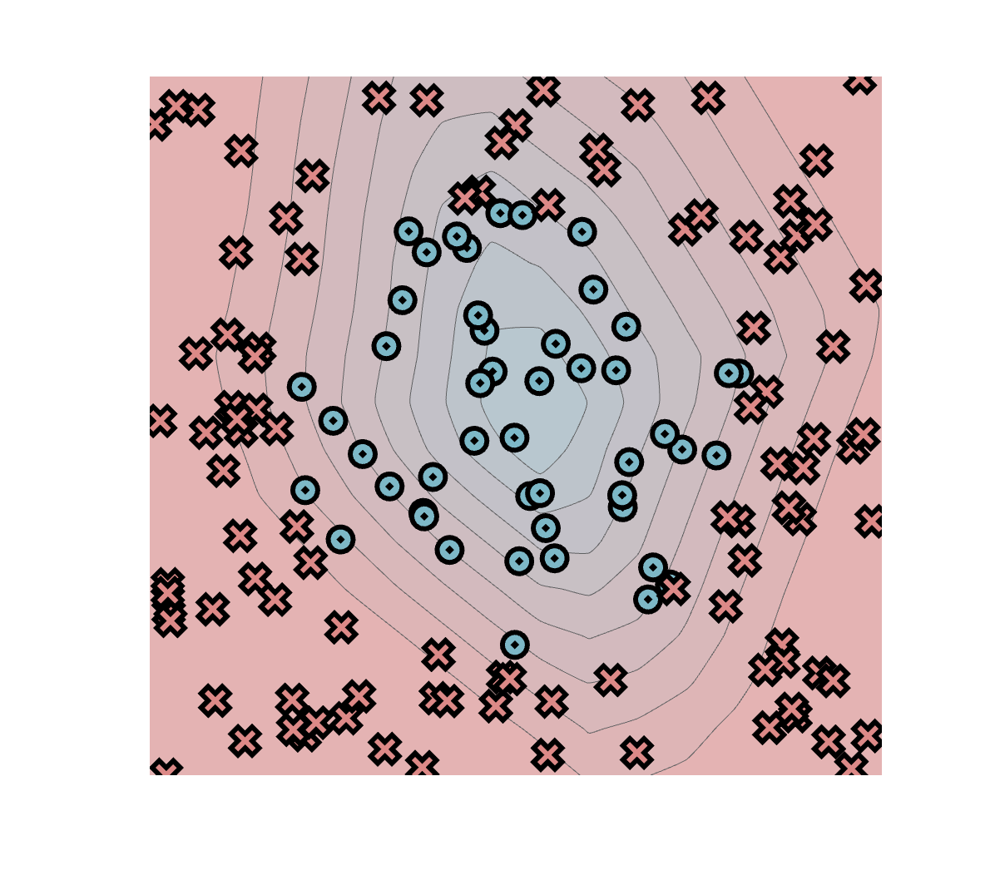
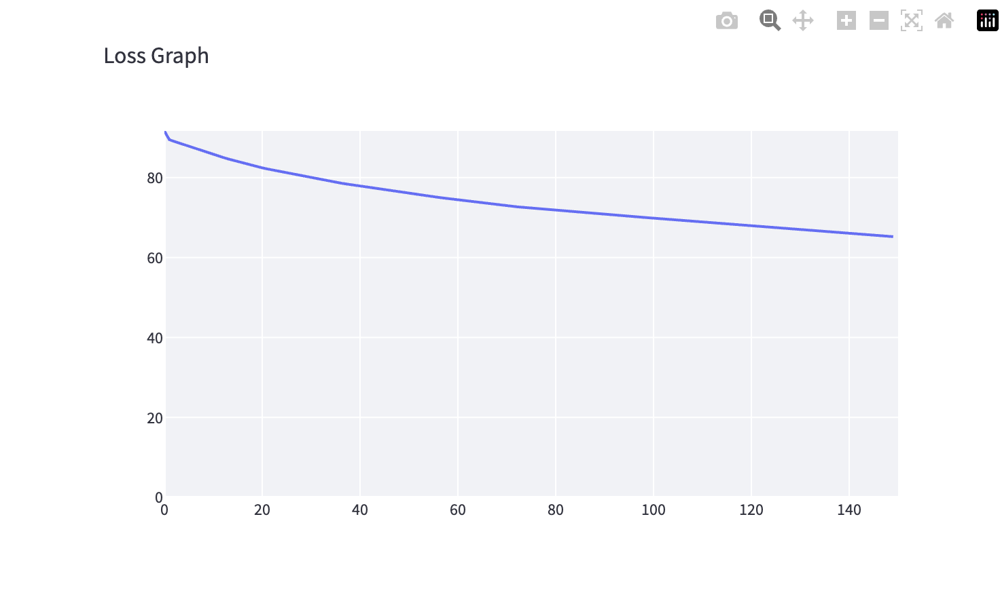
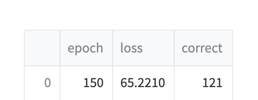

# MiniTorch Module 2

| Датасет | Эпохи | Loss | Верных ответов |
| --- | ---: | ---: | ---: |
| Simple | 100 | 19.0651 | 44 |
| Xor | 100 | 30.2514 | 38 |
| Circle | 150 | 65.2210 | 121 |

Loss падает, но ошибки ещё есть. Xor пока получился так себе.

## Simple

## Xor

## Circle

[Лог обучения](results/training.txt)

Ещё надо добавить Diag, Split, Spiral, параметры запусков и время эпохи.
